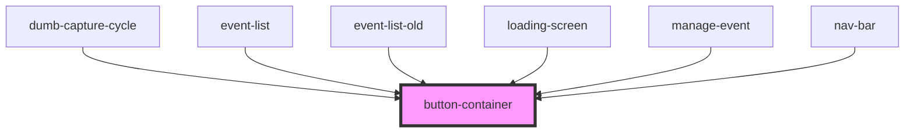

# button-container

<!-- Auto Generated Below -->

## Properties

| Property   | Attribute   | Description | Type     | Default |
| ---------- | ----------- | ----------- | -------- | ------- |
| `paddingX` | `padding-x` |             | `number` | `20`    |
| `paddingY` | `padding-y` |             | `number` | `20`    |

## Dependencies

### Used by

 - [dumb-capture-cycle](../../capture-cycle/dumb-capture-cycle)
 - [event-list](../../event-list)
 - [event-list-old](../../event-list-old)
 - [loading-screen](../../_screens/loading-screen)
 - [manage-event](../../manage-event)
 - [nav-bar](../../nav-bar)

### Graph

----------------------------------------------

*Built with [StencilJS](https://stenciljs.com/)*
