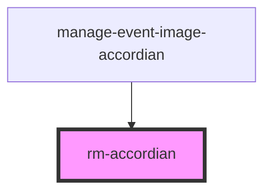

# rm-accordian

<!-- Auto Generated Below -->

## Properties

| Property               | Attribute | Description | Type                                                                                                            | Default     |
| ---------------------- | --------- | ----------- | --------------------------------------------------------------------------------------------------------------- | ----------- |
| `color`                | `color`   |             | `"accent" \| "error" \| "info" \| "neutral" \| "primary" \| "secondary" \| "success" \| "warning" \| undefined` | `undefined` |
| `heading` _(required)_ | `heading` |             | `string`                                                                                                        | `undefined` |

## Dependencies

### Used by

 - [manage-event-image-accordian](../../manage-event-image-accordian)

### Graph

----------------------------------------------

*Built with [StencilJS](https://stenciljs.com/)*
