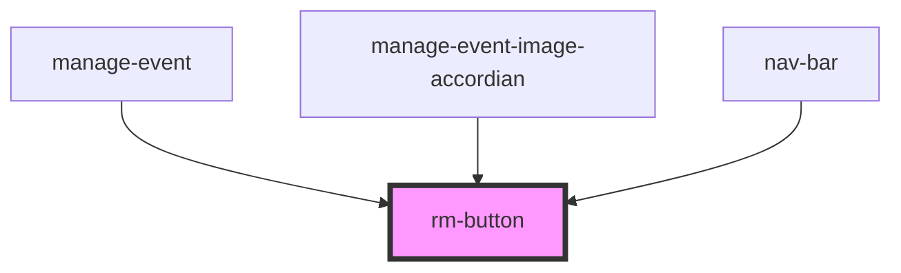

# rm-button

<!-- Auto Generated Below -->

## Properties

| Property | Attribute | Description | Type                                                                                                            | Default     |
| -------- | --------- | ----------- | --------------------------------------------------------------------------------------------------------------- | ----------- |
| `color`  | `color`   |             | `"accent" \| "error" \| "info" \| "neutral" \| "primary" \| "secondary" \| "success" \| "warning" \| undefined` | `undefined` |

## Dependencies

### Used by

 - [manage-event](../../manage-event)
 - [manage-event-image-accordian](../../manage-event-image-accordian)
 - [nav-bar](../../nav-bar)

### Graph

----------------------------------------------

*Built with [StencilJS](https://stenciljs.com/)*
