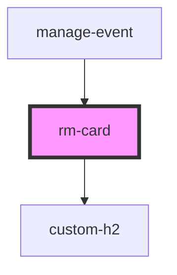

# rm-card

<!-- Auto Generated Below -->

## Properties

| Property  | Attribute | Description | Type                  | Default     |
| --------- | --------- | ----------- | --------------------- | ----------- |
| `heading` | `heading` |             | `string \| undefined` | `undefined` |

## Dependencies

### Used by

 - [manage-event](../../manage-event)

### Depends on

- [custom-h2](../custom-h2)

### Graph

----------------------------------------------

*Built with [StencilJS](https://stenciljs.com/)*
