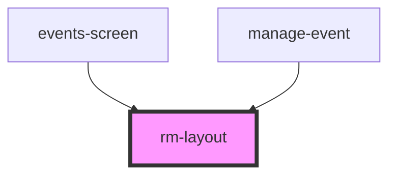

# rm-layout

<!-- Auto Generated Below -->

## Dependencies

### Used by

 - [events-screen](../../_screens/events-screen)
 - [manage-event](../../manage-event)

### Graph

----------------------------------------------

*Built with [StencilJS](https://stenciljs.com/)*
