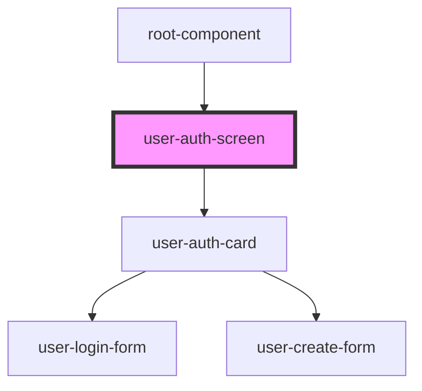

# user-auth-screen

<!-- Auto Generated Below -->

## Dependencies

### Used by

 - [root-component](../../root-component)

### Depends on

- [user-auth-card](../../user-auth-card)

### Graph

----------------------------------------------

*Built with [StencilJS](https://stenciljs.com/)*
