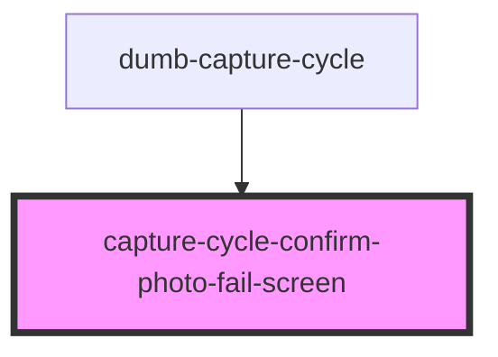

# capture-cycle-confirm-photo-fail-screen

<!-- Auto Generated Below -->

## Properties

| Property | Attribute | Description | Type                  | Default     |
| -------- | --------- | ----------- | --------------------- | ----------- |
| `error`  | `error`   |             | `string \| undefined` | `undefined` |

## Events

| Event             | Description | Type               |
| ----------------- | ----------- | ------------------ |
| `startAgainClick` |             | `CustomEvent<any>` |

## Dependencies

### Used by

 - [dumb-capture-cycle](../dumb-capture-cycle)

### Graph

----------------------------------------------

*Built with [StencilJS](https://stenciljs.com/)*
