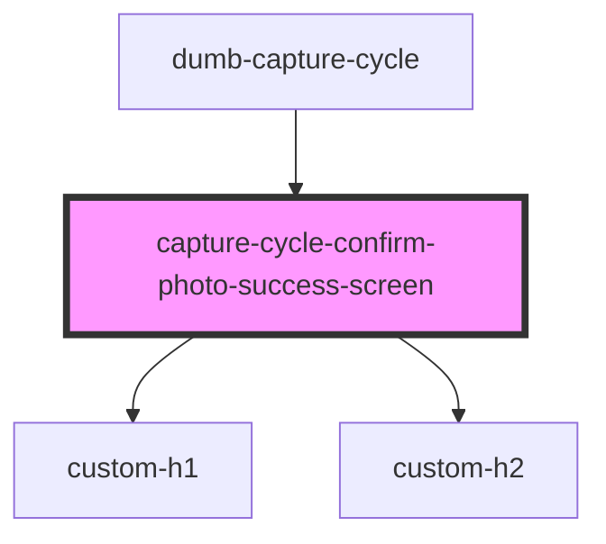

# capture-cycle-confirm-photo-success-screen

<!-- Auto Generated Below -->

## Events

| Event             | Description | Type               |
| ----------------- | ----------- | ------------------ |
| `startAgainClick` |             | `CustomEvent<any>` |

## Dependencies

### Used by

 - [dumb-capture-cycle](../dumb-capture-cycle)

### Depends on

- [custom-h1](../../_atoms/custom-h1)
- [custom-h2](../../_atoms/custom-h2)

### Graph

----------------------------------------------

*Built with [StencilJS](https://stenciljs.com/)*
