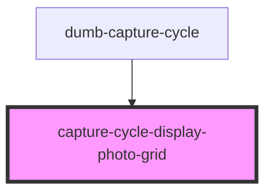

# capture-cycle-display-photo-grid

<!-- Auto Generated Below -->

## Events

| Event         | Description | Type                  |
| ------------- | ----------- | --------------------- |
| `selectPhoto` |             | `CustomEvent<string>` |

## Methods

### `addImageDataUrls(newImageDataUrls: string) => Promise<void>`

#### Parameters

| Name               | Type     | Description |
| ------------------ | -------- | ----------- |
| `newImageDataUrls` | `string` |             |

#### Returns

Type: `Promise<void>`

### `clearImageDataUrls() => Promise<void>`

#### Returns

Type: `Promise<void>`

## Dependencies

### Used by

 - [dumb-capture-cycle](../dumb-capture-cycle)

### Graph

----------------------------------------------

*Built with [StencilJS](https://stenciljs.com/)*
