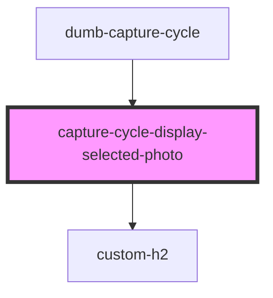

# capture-cycle-display-selected-photo

<!-- Auto Generated Below -->

## Properties

| Property               | Attribute                 | Description | Type                  | Default     |
| ---------------------- | ------------------------- | ----------- | --------------------- | ----------- |
| `selectedImageDataUrl` | `selected-image-data-url` |             | `string \| undefined` | `undefined` |

## Dependencies

### Used by

 - [dumb-capture-cycle](../dumb-capture-cycle)

### Depends on

- [custom-h2](../../_atoms/custom-h2)

### Graph

----------------------------------------------

*Built with [StencilJS](https://stenciljs.com/)*
