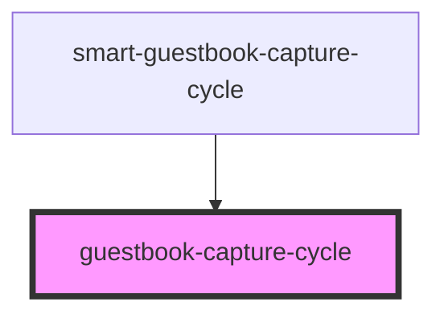

# guestbook-capture-cycle

<!-- Auto Generated Below -->

## Properties

| Property                       | Attribute | Description | Type                                                                                                                       | Default     |
| ------------------------------ | --------- | ----------- | -------------------------------------------------------------------------------------------------------------------------- | ----------- |
| `mediaDimensions` _(required)_ | --        |             | `{ videoElementWidth: number; videoElementHeight: number; mediaWidth: number; mediaHeight: number; aspectRatio: number; }` | `undefined` |

## Methods

### `capture() => Promise<string | undefined>`

#### Returns

Type: `Promise<string | undefined>`

### `clearCountdown() => Promise<void>`

#### Returns

Type: `Promise<void>`

### `countdown(start: number, stop: number) => Promise<void>`

#### Parameters

| Name    | Type     | Description |
| ------- | -------- | ----------- |
| `start` | `number` |             |
| `stop`  | `number` |             |

#### Returns

Type: `Promise<void>`

### `setCountdownInt(num: number) => Promise<void>`

#### Parameters

| Name  | Type     | Description |
| ----- | -------- | ----------- |
| `num` | `number` |             |

#### Returns

Type: `Promise<void>`

## Dependencies

### Used by

 - [smart-guestbook-capture-cycle](../smart-guestbook-capture-cycle)

### Graph

----------------------------------------------

*Built with [StencilJS](https://stenciljs.com/)*
