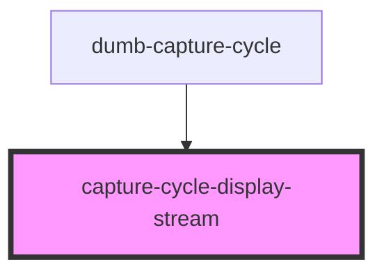

# guestbook-capture-cycle

<!-- Auto Generated Below -->

## Properties

| Property                      | Attribute | Description | Type                                                                                                                       | Default     |
| ----------------------------- | --------- | ----------- | -------------------------------------------------------------------------------------------------------------------------- | ----------- |
| `streamSettings` _(required)_ | --        |             | `{ videoElementWidth: number; videoElementHeight: number; mediaWidth: number; mediaHeight: number; aspectRatio: number; }` | `undefined` |

## Methods

### `capture() => Promise<string | undefined>`

#### Returns

Type: `Promise<string | undefined>`

### `countdown(p: { start: number; stop: number; clear: boolean; delayInMs?: number | undefined; cb?: ((num: number) => Promise<any> | any) | undefined; }) => Promise<void>`

#### Parameters

| Name | Type                                                                                                                          | Description |
| ---- | ----------------------------------------------------------------------------------------------------------------------------- | ----------- |
| `p`  | `{ start: number; stop: number; clear: boolean; delayInMs?: number \| undefined; cb?: ((num: number) => any) \| undefined; }` |             |

#### Returns

Type: `Promise<void>`

## Dependencies

### Used by

 - [dumb-capture-cycle](../dumb-capture-cycle)

### Graph

----------------------------------------------

*Built with [StencilJS](https://stenciljs.com/)*
