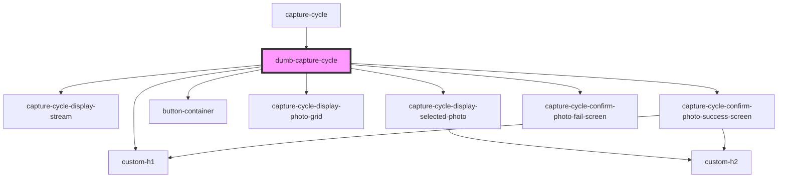

# dumb-capture-cycle

<!-- Auto Generated Below -->

## Properties

| Property                      | Attribute | Description | Type                                                                                                                       | Default     |
| ----------------------------- | --------- | ----------- | -------------------------------------------------------------------------------------------------------------------------- | ----------- |
| `streamSettings` _(required)_ | --        |             | `{ videoElementWidth: number; videoElementHeight: number; mediaWidth: number; mediaHeight: number; aspectRatio: number; }` | `undefined` |

## Dependencies

### Used by

 - [capture-cycle](../capture-cycle)

### Depends on

- [custom-h1](../../_atoms/custom-h1)
- [capture-cycle-display-stream](../capture-cycle-display-stream)
- [capture-cycle-display-selected-photo](../capture-cycle-display-selected-photo)
- [button-container](../../_atoms/button-container)
- [capture-cycle-display-photo-grid](../capture-cycle-display-photo-grid)
- [capture-cycle-confirm-photo-success-screen](../capture-cycle-confirm-photo-success-screen)
- [capture-cycle-confirm-photo-fail-screen](../capture-cycle-confirm-photo-fail-screen)

### Graph

----------------------------------------------

*Built with [StencilJS](https://stenciljs.com/)*
