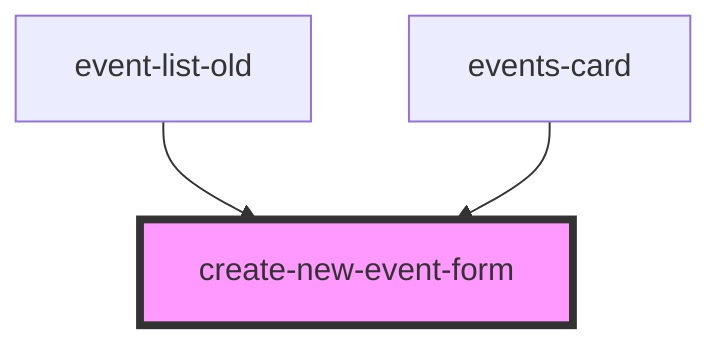

# create-new-event-form

<!-- Auto Generated Below -->

## Events

| Event                | Description | Type               |
| -------------------- | ----------- | ------------------ |
| `createEventSuccess` |             | `CustomEvent<any>` |

## Dependencies

### Used by

 - [event-list-old](../event-list-old)
 - [events-card](../events-card)

### Graph

----------------------------------------------

*Built with [StencilJS](https://stenciljs.com/)*
