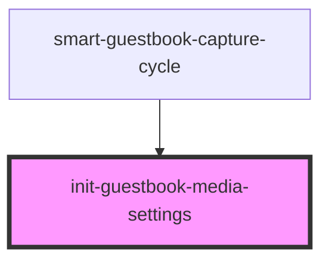

# init-guestbook-media-settings

<!-- Auto Generated Below -->

## Properties

| Property                   | Attribute      | Description | Type     | Default     |
| -------------------------- | -------------- | ----------- | -------- | ----------- |
| `aspectRatio` _(required)_ | `aspect-ratio` |             | `number` | `undefined` |
| `idealWidth` _(required)_  | `ideal-width`  |             | `number` | `undefined` |

## Events

| Event                  | Description | Type                                                                                                                                    |
| ---------------------- | ----------- | --------------------------------------------------------------------------------------------------------------------------------------- |
| `initSettingsComplete` |             | `CustomEvent<{ videoElementWidth: number; videoElementHeight: number; mediaWidth: number; mediaHeight: number; aspectRatio: number; }>` |
| `initSettingsError`    |             | `CustomEvent<string>`                                                                                                                   |

## Dependencies

### Used by

 - [smart-guestbook-capture-cycle](../smart-guestbook-capture-cycle)

### Graph

----------------------------------------------

*Built with [StencilJS](https://stenciljs.com/)*
