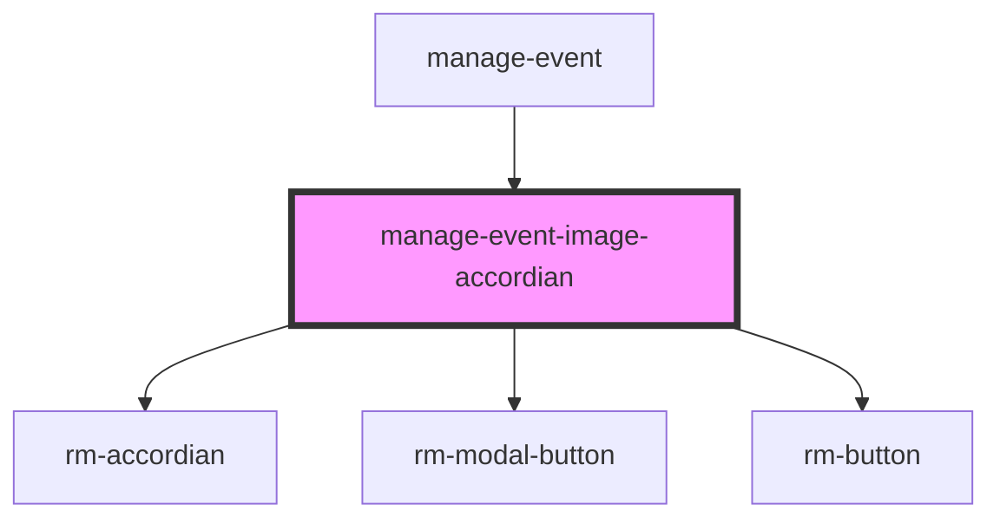

# manage-event-image-accordian

<!-- Auto Generated Below -->

## Properties

| Property                            | Attribute | Description | Type                                                                                                                                                | Default     |
| ----------------------------------- | --------- | ----------- | --------------------------------------------------------------------------------------------------------------------------------------------------- | ----------- |
| `selectedImageDbEntry` _(required)_ | --        |             | `{ id: string; createdAt: string; groupId: string; eventId: string; userId: string; storagePath: string; downloadUrl: string; updatedAt: string; }` | `undefined` |

## Dependencies

### Used by

 - [manage-event](../manage-event)

### Depends on

- [rm-accordian](../_atoms/rm-accordian)
- [rm-modal-button](../_atoms/rm-modal-button)
- [rm-button](../_atoms/rm-button)

### Graph

----------------------------------------------

*Built with [StencilJS](https://stenciljs.com/)*
