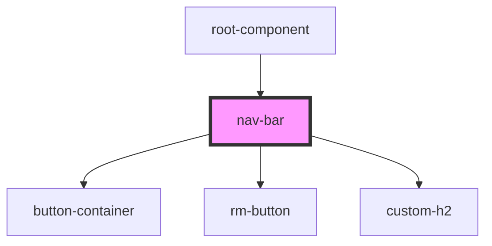

# nav-bar

<!-- Auto Generated Below -->

## Dependencies

### Used by

 - [root-component](../root-component)

### Depends on

- [button-container](../_atoms/button-container)
- [rm-button](../_atoms/rm-button)
- [custom-h2](../_atoms/custom-h2)

### Graph

----------------------------------------------

*Built with [StencilJS](https://stenciljs.com/)*
