# root-component

<!-- Auto Generated Below -->

## Dependencies

### Depends on

- [nav-bar](../nav-bar)
- [loading-screen](../_screens/loading-screen)
- [user-auth-screen](../_screens/user-auth-screen)
- [events-screen](../_screens/events-screen)
- [capture-cycle](../capture-cycle/capture-cycle)
- [manage-event](../manage-event)

### Graph

```mermaid
graph TD;
  root-component --> nav-bar
  root-component --> loading-screen
  root-component --> user-auth-screen
  root-component --> events-screen
  root-component --> capture-cycle
  root-component --> manage-event
  nav-bar --> button-container
  nav-bar --> rm-button
  nav-bar --> custom-h2
  loading-screen --> button-container
  user-auth-screen --> user-auth-card
  user-auth-card --> user-login-form
  user-auth-card --> user-create-form
  events-screen --> rm-layout
  events-screen --> events-card
  events-card --> custom-h2
  events-card --> create-new-event-form
  events-card --> custom-h3
  events-card --> event-list
  event-list --> button-container
  capture-cycle --> dumb-capture-cycle
  dumb-capture-cycle --> custom-h1
  dumb-capture-cycle --> capture-cycle-display-stream
  dumb-capture-cycle --> capture-cycle-display-selected-photo
  dumb-capture-cycle --> button-container
  dumb-capture-cycle --> capture-cycle-display-photo-grid
  dumb-capture-cycle --> capture-cycle-confirm-photo-success-screen
  dumb-capture-cycle --> capture-cycle-confirm-photo-fail-screen
  capture-cycle-display-selected-photo --> custom-h2
  capture-cycle-confirm-photo-success-screen --> custom-h1
  capture-cycle-confirm-photo-success-screen --> custom-h2
  manage-event --> rm-layout
  manage-event --> rm-card
  manage-event --> button-container
  manage-event --> rm-button
  manage-event --> manage-event-image-accordian
  rm-card --> custom-h2
  manage-event-image-accordian --> rm-accordian
  manage-event-image-accordian --> rm-modal-button
  manage-event-image-accordian --> rm-button
  style root-component fill:#f9f,stroke:#333,stroke-width:4px
```

----------------------------------------------

*Built with [StencilJS](https://stenciljs.com/)*
