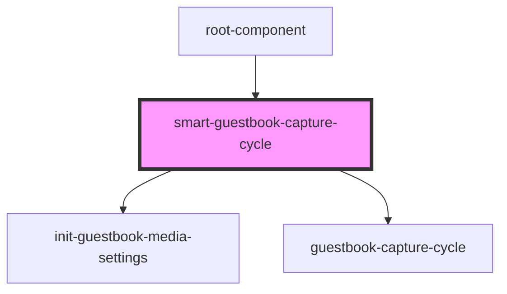

# smart-guestbook-capture-cycle

<!-- Auto Generated Below -->

## Dependencies

### Used by

 - [root-component](../root-component)

### Depends on

- [init-guestbook-media-settings](../init-guestbook-media-settings)
- [guestbook-capture-cycle](../guestbook-capture-cycle)

### Graph

----------------------------------------------

*Built with [StencilJS](https://stenciljs.com/)*
