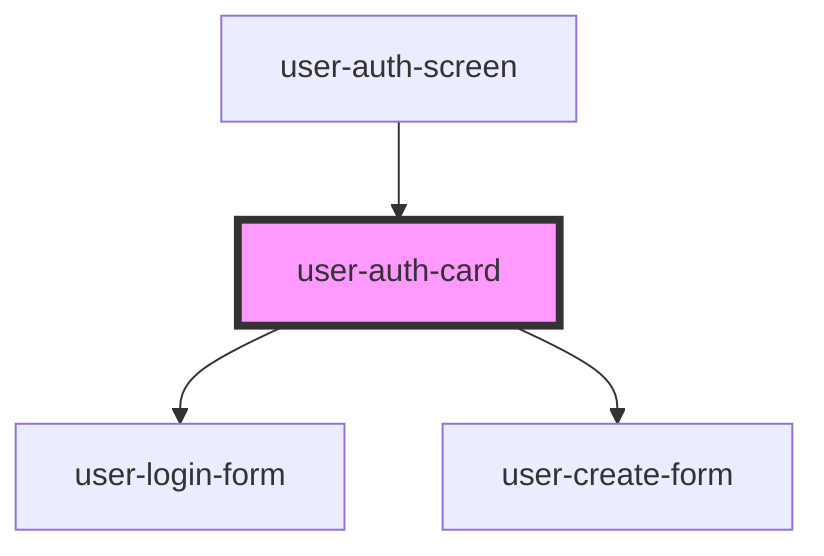

# user-auth-card

<!-- Auto Generated Below -->

## Dependencies

### Used by

 - [user-auth-screen](../_screens/user-auth-screen)

### Depends on

- [user-login-form](../user-login-form)
- [user-create-form](../user-create-form)

### Graph

----------------------------------------------

*Built with [StencilJS](https://stenciljs.com/)*
