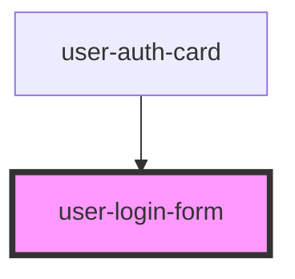

# user-login-form

<!-- Auto Generated Below -->

## Events

| Event          | Description | Type               |
| -------------- | ----------- | ------------------ |
| `loginFail`    |             | `CustomEvent<any>` |
| `loginSuccess` |             | `CustomEvent<any>` |

## Dependencies

### Used by

 - [user-auth-card](../user-auth-card)

### Graph

----------------------------------------------

*Built with [StencilJS](https://stenciljs.com/)*
